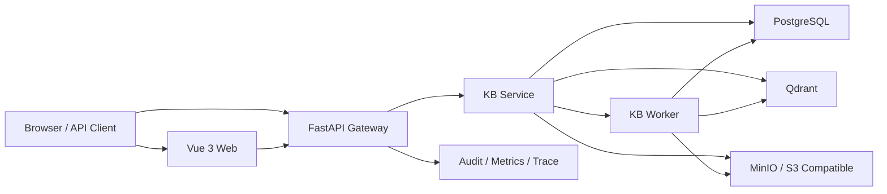

# RAG-QA 2.0

[](https://github.com/icefunicu/rag-qa-system/actions/workflows/ci.yml)
[](LICENSE)
[](https://github.com/icefunicu/rag-qa-system/stargazers)


面向企业知识库场景的本地化 RAG 问答系统，提供 `gateway`、`kb-service`、`kb-worker` 和 `Vue 3` 管理端，覆盖知识库管理、分片上传、异步 ingest、检索、证据化回答、审计与可观测性。

仓库默认采用“零数据基线”交付：不预置 demo 知识库、评测样例或 benchmark 快照。系统可以直接启动，但数据和评测输入需要你自行提供。

[快速开始](#快速开始) · [适用场景](#适用场景) · [技术栈](#技术栈) · [架构概览](#架构概览) · [api-快速示例](#api-快速示例) · [开发与验证](#开发与验证) · [文档索引](#文档索引)

## 为什么选择本仓库

- 不是单文件 demo，而是可落地的多服务 RAG 工程骨架
- 上传、ingest、检索、问答、审计、观测链路完整可验证
- 默认本地开发可直接跑通，同时保留清晰的服务边界和扩展空间
- 强调证据化回答、幂等控制、可回放排障，而不是只返回一段模型文本

## 功能亮点

- 知识库与文档生命周期管理：创建、更新、删除知识库与文档，支持详情与事件流查询
- 分片直传上传链路：创建上传会话、分片预签名、断点续传、完成上传、查询 ingest 状态
- 异步 ingest：文档状态按 `uploaded -> parsing_fast -> fast_index_ready -> hybrid_ready -> ready` 推进
- 检索与问答：支持 `/api/v1/kb/retrieve`、`/api/v1/kb/query` 和统一聊天 `/api/v1/chat/...`
- 流式返回：KB 单库问答和统一聊天都支持 SSE
- 证据化回答：返回 `citations`、`grounding_score`、`retrieval`、`latency`、`cost`、`trace_id`
- 可观测性：提供 `/healthz`、`/readyz`、`/metrics` 和 trace 透传
- 权限与审计：本地默认角色包含 `platform_admin` 和 `kb_editor`，网关可聚合审计事件
- 幂等控制：聊天消息、上传创建与完成接口支持 `Idempotency-Key`，冲突时返回 `409 idempotency_conflict`

## 适用场景

| 场景 | 你可以做什么 | 项目中对应的能力 |
| --- | --- | --- |
| 企业制度问答 | 让员工围绕制度、手册、规范进行可追溯问答 | 证据化回答、引文返回、拒答机制 |
| 内部知识库接入 | 将 PDF / DOCX / TXT 接入并异步索引 | Multipart 上传、异步 ingest、文档事件流 |
| 工程化 RAG 原型 | 搭建有服务边界、有审计、有 metrics 的本地原型 | Gateway / KB Service / Worker 架构 |
| 评测与排障 | 对检索质量、响应延迟、失败链路做验证 | trace_id、metrics、评测脚本、runbook |

## 端到端工作流

1. 创建知识库并上传文档，前端通过预签名 URL 直接上传到对象存储。
2. `kb-service` 创建上传会话和 ingest 作业，`kb-worker` 异步执行解析、切段、索引和 embedding。
3. 文档状态从 `uploaded` 逐步推进到 `ready`，在中间阶段也可以按能力开放查询。
4. 用户通过 KB 问答或统一聊天接口发起问题，网关协调 scope、检索、证据筛选和答案生成。
5. 响应返回答案本身以及 `citations`、`retrieval`、`latency`、`cost`、`trace_id`，便于前端展示和运维排障。

## 技术栈


| 层 | 技术 |
| --- | --- |
| Frontend | Vue 3, TypeScript, Vite, Element Plus, Pinia |
| Gateway | FastAPI, Uvicorn, httpx, PyJWT, Prometheus client |
| KB Service | FastAPI, boto3, Pillow, pypdf, python-docx, PostgreSQL |
| Worker / Shared | Python, shared retrieval/auth/storage modules |
| Storage / Infra | PostgreSQL, MinIO, Qdrant, Docker Compose |
| Quality | pytest, compileall, GitHub Actions, encoding check |

## 快速开始

### 前置条件

- 已安装并启动 `Docker Desktop`
- 已安装 `Python`
- 已安装 `Node.js` 与 `npm`
- 已安装 `make`，如果本机没有 `make`，可直接执行对应的 PowerShell 脚本

说明：当前仓库提供的一键开发脚本以 PowerShell 为主，Windows 环境体验最佳；其他环境可参考 `docker-compose.yml`、`apps/web/package.json` 和 `scripts/quality/ci-check.ps1` 手动执行。

### 1. 复制环境变量模板

```powershell
Copy-Item .env.example .env
```

### 2. 初始化数据库与对象存储

```powershell
make init
```

等价命令：

```powershell
powershell -NoProfile -ExecutionPolicy Bypass -File scripts/dev/init.ps1
```

### 3. 启动本地环境

```powershell
make up
```

等价命令：

```powershell
powershell -NoProfile -ExecutionPolicy Bypass -File scripts/dev/up.ps1
```

`make up` 会执行以下动作：

- 拉取或构建镜像
- 启动 `postgres` 与 `minio`
- 显式运行 `stack-init`
- 启动 `kb-service`、`kb-worker`、`gateway`
- 在本地启动并托管前端开发服务器

### 4. 停止环境

```powershell
make down
```

等价命令：

```powershell
powershell -NoProfile -ExecutionPolicy Bypass -File scripts/dev/down.ps1
```

### 5. 启动后建议先做的事

1. 使用本地账号登录前端或调用 `/api/v1/auth/login`。
2. 创建一个知识库。
3. 上传 `txt`、`pdf`、`docx`、`png`、`jpg` 或 `jpeg` 文档并等待 ingest 状态进入 `fast_index_ready` 或 `ready`。
4. 进入 KB 问答页或统一聊天页验证回答和引文。

## 默认访问地址

- Web: `http://localhost:5173`
- Gateway: `http://localhost:8080`
- KB Service: `http://localhost:8300`
- Qdrant HTTP: `http://localhost:6333`
- Qdrant gRPC: `localhost:6334`
- MinIO API: `http://localhost:9000`
- MinIO Console: `http://localhost:9001`
- Gateway Health: `http://localhost:8080/healthz`
- Gateway Readiness: `http://localhost:8080/readyz`
- Gateway Metrics: `http://localhost:8080/metrics`
- KB Health: `http://localhost:8300/healthz`
- KB Readiness: `http://localhost:8300/readyz`
- KB Metrics: `http://localhost:8300/metrics`

### Qdrant / FastEmbed 閰嶇疆琛ュ厖

- `kb-service` 鍜?`kb-worker` 浣跨敤 `QDRANT_URL` 鍜?`QDRANT_COLLECTION` 璁块棶鍚戦噺瀛樺偍
- 鏈湴鍚戦噺妯″瀷鐢?`FASTEMBED_MODEL_NAME`銆乣FASTEMBED_VECTOR_SIZE`銆乣FASTEMBED_THREADS` 鎺у埗
- `GET /readyz` 鐜板湪浼氬悓鏃舵鏌?database`銆乣object_storage` 鍜?vector_store`

## 本地认证与权限

本地开发默认账号来自 [`.env.example`](.env.example)：

- `admin@local`：映射到 `platform_admin`
- `member@local`：映射到 `kb_editor`

默认密码仅用于本地开发占位。非本地环境必须至少覆盖以下变量，否则服务会在启动阶段拒绝运行：

- `JWT_SECRET`
- `ADMIN_PASSWORD`
- `MEMBER_PASSWORD`

`/api/v1/auth/login` 与 `/api/v1/auth/me` 会返回 `permissions` 和 `role_version`，前端可按能力而不是按角色名做权限控制。

## 架构概览



### 服务职责

- `gateway`：认证、会话管理、统一聊天入口、跨知识库编排、审计聚合
- `kb-service`：知识库、文档、上传会话、ingest 作业、检索与单库问答
- `kb-worker`：异步解析、索引、embedding 和重试处理
- `apps/web`：Vue 3 管理端，负责登录、上传、检索、问答、审计查看

## API 快速示例

下面的示例更适合作为“本地已经启动并完成登录后的最小验证”，也是高赞产品 README 常见的写法。

### 1. 健康检查

```bash
curl http://localhost:8080/healthz
```

期望返回：

```json
{"status":"ok"}
```

### 2. 登录获取 Token

```bash
curl -X POST http://localhost:8080/api/v1/auth/login \
  -H "Content-Type: application/json" \
  -d '{"email":"admin@local","password":"ChangeMe123!"}'
```

### 3. 对单个知识库发起问答

将 `<ACCESS_TOKEN>` 和 `<KB_ID>` 替换为你的真实值：

```bash
curl -X POST http://localhost:8300/api/v1/kb/query \
  -H "Authorization: Bearer <ACCESS_TOKEN>" \
  -H "Content-Type: application/json" \
  -d '{
    "base_id": "<KB_ID>",
    "question": "报销审批需要哪些角色签字？",
    "document_ids": []
  }'
```

典型响应字段：

```json
{
  "answer": "...",
  "answer_mode": "grounded",
  "evidence_status": "grounded",
  "grounding_score": 0.82,
  "citations": [],
  "retrieval": {},
  "trace_id": "kb-xxxx"
}
```

如果你更偏向统一聊天入口，可以使用 `/api/v1/chat/sessions` 和 `/api/v1/chat/sessions/{id}/messages` 组合调用。

## 仓库结构

- `apps/services/api-gateway/`：网关服务
- `apps/services/knowledge-base/`：知识库服务与 worker
- `apps/web/`：前端管理台
- `packages/python/shared/`：共享鉴权、SSE、检索、向量、存储、错误模型等基础能力
- `scripts/dev/`：本地初始化、启动、停止脚本
- `scripts/evaluation/`：评测与 benchmark 脚本
- `scripts/quality/`：编码检查与 CI 检查脚本
- `docs/`：API、开发脚本、运维 runbook、后端设计说明

## 推荐 API 路径

### 上传与 ingest

- `POST /api/v1/kb/uploads`
- `POST /api/v1/kb/uploads/{upload_id}/parts/presign`
- `POST /api/v1/kb/uploads/{upload_id}/complete`
- `GET /api/v1/kb/ingest-jobs/{job_id}`
- `POST /api/v1/kb/ingest-jobs/{job_id}/retry`

兼容接口 `POST /api/v1/kb/documents/upload` 仍保留，但不再是推荐入口。

### 检索与问答

- `POST /api/v1/kb/retrieve`
- `POST /api/v1/kb/query`
- `POST /api/v1/kb/query/stream`
- `POST /api/v1/chat/sessions`
- `POST /api/v1/chat/sessions/{id}/messages`
- `POST /api/v1/chat/sessions/{id}/messages/stream`

### 审计与系统接口

- `GET /api/v1/audit/events`
- `GET /healthz`
- `GET /readyz`
- `GET /metrics`

完整接口说明见 [`docs/reference/api-specification.md`](docs/reference/api-specification.md)。

## 项目边界

- 仓库默认不携带 demo 语料、历史 benchmark 报告或固定评测结论。
- 本地默认账号和密码仅用于开发环境占位，不能视为生产配置。
- README 展示的是当前仓库已实现的主链路能力，不承诺生产 SLA。
- 历史兼容接口仍保留，但 README 只推荐当前主入口。

## 支持的文档格式

当前知识库上传接口明确支持：

- `txt`
- `pdf`
- `docx`
- `png`
- `jpg`
- `jpeg`

## 开发与验证

文档改动的最小基线验证：

```powershell
python scripts/quality/check-encoding.py
docker compose config --quiet
```

完整基线验证：

```powershell
python scripts/quality/check-encoding.py
cd apps/web && npm run build
python -m compileall packages/python apps/services/api-gateway apps/services/knowledge-base
python -m pytest tests -q
docker compose config --quiet
```

也可以直接运行聚合脚本：

```powershell
powershell -File scripts/quality/ci-check.ps1
```

## 评测与 Benchmark

仓库保留了评测脚本入口，但所有输入都需要显式提供；不会再隐式消费仓库内 demo 数据。

```powershell
python scripts/evaluation/benchmark-local-ingest.py --kb-path <glob-or-file> --kb-path <glob-or-file>
python scripts/evaluation/run-retrieval-ablation.py --fixture <fixture.json>
python scripts/evaluation/compare-embedding-providers.py --fixture <fixture.json>
python scripts/evaluation/eval-long-rag.py --password <pwd> --eval-file <eval.json> --corpus-id kb:<uuid>
python scripts/evaluation/run-eval-suite.py --password <pwd> --config <suite.json>
```

## 文档索引

- [API 规范](docs/reference/api-specification.md)
- [开发脚本](docs/development/dev-scripts.md)
- [运维手册](docs/operations/runbook.md)
- [后端工程深入](docs/backend/engineering-deep-dive.md)
- [贡献指南](CONTRIBUTING.md)
- [安全政策](SECURITY.md)

## 协作约定

- Commit message 使用 Conventional Commits
- 提交说明建议包含 `What / Why / How to verify / Risk`
- 接口、配置或启动方式发生变化时，需要同步更新 README 或对应文档

更多协作细则见 [AGENTS.md](AGENTS.md)。

## 许可证

本项目基于 [MIT License](LICENSE) 发布。

## 2026-03 LangChain 集成说明

- `kb-service` 与 `kb-worker` 现在通过 `langchain-qdrant` 读写 Qdrant，KB 检索链路的中间表示统一为 LangChain `Document`
- `api-gateway` 与 `kb-service` 的回答生成统一为 LangChain prompt/runnable 链，外部 HTTP API 与 SSE 契约保持不变
- 稀疏检索模型由 `FASTEMBED_SPARSE_MODEL_NAME` 控制，默认值为 `Qdrant/bm25`
