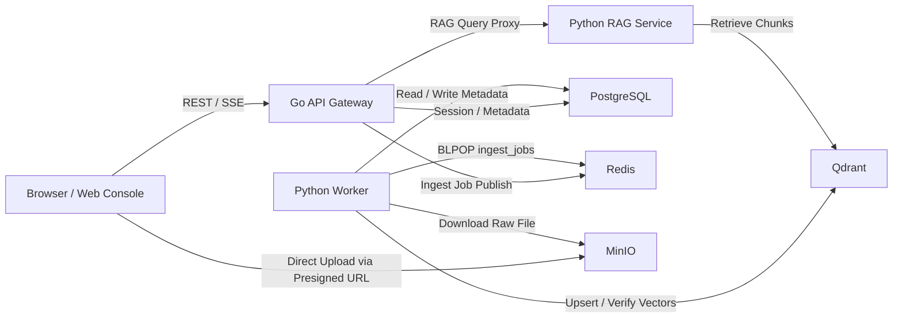
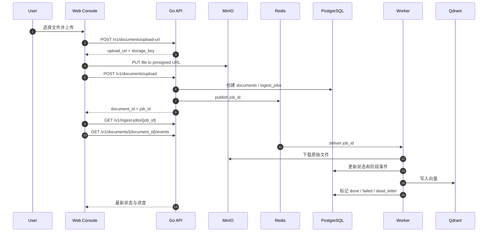
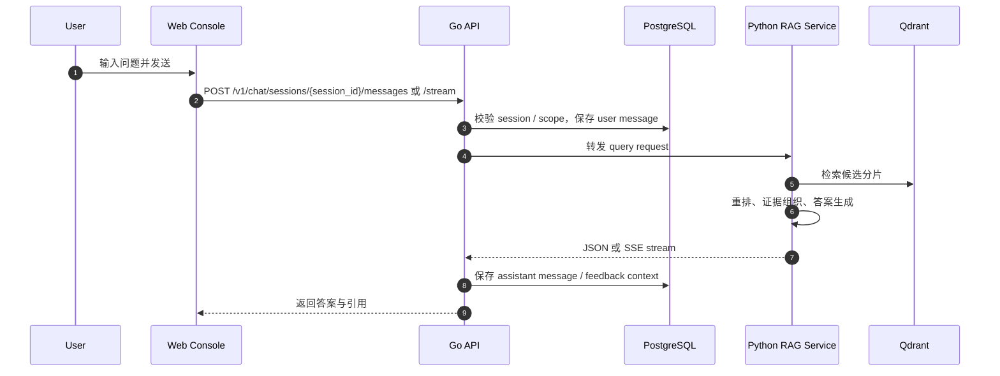

# 架构说明

本文档描述 RAG-QA System 的运行组件、边界职责和两条关键业务链路：文档入库与问答请求。

## 组件视图

## 组件职责

| 组件 | 主要职责 | 不负责的内容 |
| --- | --- | --- |
| Web Console | 页面交互、上传、轮询进度、对话展示 | 不直接调用向量库或对象存储内部接口 |
| Go API Gateway | 认证、会话、资源校验、上传编排、RAG 代理 | 不执行大文件解析和向量计算 |
| Python RAG Service | 检索、重排、答案组装、流式响应 | 不负责文档上传和对象存储写入 |
| Python Worker | 异步入库、解析、切块、嵌入、索引校验 | 不处理用户登录和会话界面 |
| PostgreSQL | 元数据与业务状态源 | 不保存原始文件 |
| Redis | 会话存储与任务队列 | 不保存长期业务数据 |
| MinIO | 原始文档对象存储 | 不提供解析与索引 |
| Qdrant | 向量索引存储 | 不保存业务会话数据 |

## 关键设计选择

### 上传走直传，不走文件透传

浏览器先向 Go API 申请预签名 URL，再直接上传到 MinIO，避免让 API 网关承受大文件中转压力。

### 入库走异步状态机

Go API 只负责接受元数据并发出任务，真正的下载、解析、切块、向量化和校验由 Worker 后台执行。

### 状态展示以前端友好为目标

前端不是只展示一个“处理中”标签，而是拉取：

- `ingest_jobs` 当前状态与进度
- `ingest_events` 阶段事件
- `document` 最终状态

### 会话与问答边界清晰

Web Console 不直接请求 Python RAG Service，而是统一经过 Go API，便于做认证、持久化和统一错误模型。

## 文档入库时序

### 入库状态

Worker 会依次推进以下阶段：

- `queued`
- `downloading`
- `parsing`
- `chunking`
- `embedding`
- `indexing`
- `verifying`
- `done`
- `failed`
- `dead_letter`

## 问答请求时序

## 数据边界

### PostgreSQL

当前仓库中可直接观察到的核心表包括：

- `corpora`
- `documents`
- `ingest_jobs`
- `document_versions`
- `ingest_events`
- `chat_sessions`
- `chat_messages`
- `answer_feedback`

### MinIO

- 保存原始上传文档
- 文档预览和在线编辑依赖同一份对象数据

### Qdrant

- 保存文档切块后的向量点
- 删除文档或知识库时，Go API 会尝试清理关联向量

## 可靠性边界

当前设计已经覆盖：

- 上传后任务异步化
- 入库阶段事件记录
- Worker 重试与死信状态
- 文档删除时的向量清理
- 大文本只读预览和编码探测

当前设计未覆盖：

- 分布式事务
- 跨实例幂等锁
- 多 Worker 分片调度优化
- 灾备、备份恢复编排

## 对外说明建议

如果需要对外简要介绍架构，可使用下面这句话：

> RAG-QA System 采用“Go 网关 + Python 检索服务 + Python 异步 Worker + PostgreSQL/Redis/MinIO/Qdrant”分层架构，重点解决文档入库可观测性和问答链路可追踪性问题。
